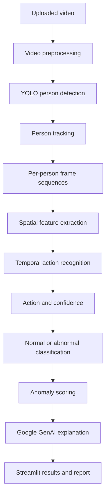

# AVAS

[](https://github.com/imxyanua/AVAS/actions/workflows/ci.yml)

AVAS is an AI-assisted video analysis system for human action recognition and anomaly detection. It analyzes motion across sequences of frames, identifies potentially abnormal behavior, and presents model evidence in a form that a human operator can review.

The project combines computer vision, temporal deep learning, and generative AI. Deep learning produces the predictions, while generative AI is limited to explaining those predictions and preparing readable reports.

> **Project status:** AVAS is under active development. Data preparation, backbone feature extraction, and baseline action recognition with training and evaluation are implemented and tested. Person detection, tracking, generated reports, and the Streamlit application are not available yet. See [Local Development](#local-development) for what can be run today.

## Key Capabilities

- Accept uploaded video files for offline analysis.
- Detect people in individual frames with YOLO.
- Preserve person identities across frames with multi-object tracking.
- Build temporal sequences for each tracked person.
- Recognize actions with a spatiotemporal deep learning model.
- Report confidence scores, timestamps, and anomaly scores.
- Classify observed behavior as normal, suspicious, or abnormal.
- Generate operator-facing explanations without changing model predictions.
- Present video, detections, tracks, events, and reports through Streamlit.

## Why Temporal Analysis Matters

Object detection answers where a person is in a frame. It does not determine what that person is doing over time.

AVAS separates these responsibilities:

```text
Person detection
       +
Person tracking
       +
Temporal modeling
       =
Action recognition
```

For example, a single frame may not reliably distinguish standing from falling. A sequence of frames captures the transition in posture and motion needed to classify the event.

## Processing Pipeline



### 1. Video Preprocessing

Uploaded videos are decoded into frames or short clips. Preprocessing may include:

- Frame-rate reduction for large videos
- Frame resizing
- Pixel normalization
- Clip segmentation
- Fixed-length sequence sampling

Sequence length and sampling strategy depend on the selected model architecture.

### 2. Person Detection

YOLO locates people in each frame and returns bounding boxes with detection confidence. Detection is a supporting component and is not used as the action classifier.

### 3. Person Tracking

ByteTrack or DeepSORT associates detections across frames. The resulting track ID allows AVAS to construct a separate motion history for each visible person.

### 4. Action Recognition

The baseline model uses a CNN and LSTM:

```text
Frame sequence
      |
      v
CNN feature extractor
      |
      v
LSTM temporal model
      |
      v
Action classifier
```

The CNN extracts visual features from each frame. The LSTM models how those features change over time and produces an action prediction for the sequence.

Alternative video architectures, such as 3D CNNs and video transformers, can be evaluated against the baseline when comparable training and test conditions are available.

### 5. Anomaly Assessment

Recognized actions are mapped to an operational category. A configuration might classify walking, standing, and sitting as normal while classifying falling or fighting as abnormal.

An anomaly score can provide additional severity information:

```text
Low score       -> Normal
Moderate score  -> Suspicious
High score      -> High risk
```

Thresholds must be calibrated from validation data. They should not be treated as universal constants.

### 6. Report Generation

Google GenAI receives structured model output such as:

- Predicted action
- Model confidence
- Event duration
- Anomaly score
- Start and end timestamps

It converts these fields into an incident summary, risk explanation, and suggested review action. It must not replace, revise, or override the underlying deep learning prediction.

## Example Analysis Output

The final schema may evolve, but an event is expected to contain information similar to:

```json
{
  "video": "security_camera_01.mp4",
  "person_id": 2,
  "action": "fighting",
  "confidence": 0.962,
  "status": "abnormal",
  "anomaly_score": 0.92,
  "start_time": "00:01:42",
  "end_time": "00:01:49"
}
```

The interface can use this structured result to highlight the relevant track, replay the event window, and display a plain-language explanation.

## Behavior Classes

The available labels depend on the training dataset. Candidate classes include:

- Walking
- Running
- Standing
- Sitting
- Falling
- Fighting
- Jumping
- Waving

AVAS does not assume that every unusual behavior can be represented by a fixed label set. Predictions are limited by the data and model used during training.

## Candidate Datasets

- **UCF101:** General human action recognition and baseline experiments
- **HMDB51:** Human motion classes and cross-dataset evaluation
- **UCF-Crime:** Long-form surveillance videos containing normal and anomalous events

Datasets are not distributed with this repository. Their licenses, access conditions, class definitions, and intended uses must be reviewed before training or redistribution.

## Data Preparation Requirements

Dataset partitions must be created at the source-video level. Frames or clips from the same video must never be split across training, validation, and test sets because that would introduce data leakage.

Other data risks that require explicit handling include:

- Class imbalance
- Duplicate or near-duplicate videos
- Incorrect or ambiguous labels
- Variation in camera angle, lighting, resolution, and background
- Differences between benchmark footage and real deployment footage

Possible imbalance controls include weighted loss, oversampling, and data augmentation. Their effect must be measured on a separate validation set.

## Evaluation

Model quality should be measured with more than accuracy:

- Precision
- Recall
- F1-score
- Per-class metrics
- Confusion matrix

Recall is especially important when the cost of missing an abnormal event is high. Precision remains necessary to prevent excessive false alerts.

Operational performance should also be reported:

- Frames processed per second
- End-to-end processing time
- Inference latency
- CPU and GPU utilization
- GPU memory consumption
- Model size

All published results should identify the dataset split, hardware, model checkpoint, input resolution, sequence length, and decision thresholds used for evaluation.

## Technology Stack

- **Language:** Python
- **Deep learning:** PyTorch and TorchVision
- **Computer vision:** OpenCV and YOLO
- **Tracking:** ByteTrack or DeepSORT
- **Data processing:** NumPy and Pandas
- **Visualization:** Matplotlib
- **Generative AI:** Google GenAI
- **Application interface:** Streamlit

Runtime dependencies are listed in `requirements.txt`; development tooling is listed in `requirements-dev.txt`.

## Repository Layout

```text
configs/                 Experiment configuration in YAML
data/                    Datasets and generated manifests (ignored by git)
models/                  Weights and training checkpoints (ignored by git)
outputs/                 Predictions, reports and figures (ignored by git)
src/preprocessing/       Video reading, frame sampling, transforms, datasets, splitting
src/features/            CNN backbone feature extraction and caching
src/models/              Temporal model and behaviour classification
src/training/            Training loop and evaluation reports
src/utils/               Configuration, seeding, device selection, metrics
tests/                   Unit tests
```

## Local Development

AVAS targets Python 3.12 or newer.

```bash
python -m venv .venv
.venv\Scripts\activate          # Windows
source .venv/bin/activate       # Linux and macOS
pip install -r requirements-dev.txt
```

Run the test suite and the linter:

```bash
pytest
ruff check .
ruff format --check .
```

### Continuous Integration

`.github/workflows/ci.yml` runs the same checks on every pull request and on every push to `main`: formatting, lint rules, a dependency conflict check, and the test suite on both Linux and Windows. PyTorch is installed from the CPU wheel index because the runners have no GPU.

## Preparing a Dataset Split

Arrange source videos so that each class is a directory:

```text
data/raw/avas_baseline/
├── walking/
│   ├── v_walking_g01_c01.avi
│   └── v_walking_g01_c02.avi
└── falling/
    └── v_falling_g04_c01.avi
```

Describe the dataset in `configs/dataset.yaml`, then build the split manifest:

```bash
python -m src.preprocessing.build_splits --config configs/dataset.yaml --summary outputs/reports/split_summary.json
```

The command writes a CSV manifest with one row per video, recording its split, class, and source-recording group. The `group_pattern` setting controls how that group is recovered from the file name, and every clip sharing a group is placed in the same split. The split is deterministic for a given seed, and the command fails if any recording would appear in more than one split.

## Caching Backbone Features

The baseline keeps the CNN backbone frozen, so the features it produces for a clip never change during training. Computing them once and storing them on disk removes video decoding and the convolutional forward pass from every epoch, which is what makes training practical without a discrete GPU.

```bash
python -m src.features.build_feature_cache --clips-per-video 1
```

Each cached file holds a `(clip_length, feature_dim)` array for one clip, and an `index.csv` records the split, class, source recording, sampled frame indices, and file path of every entry. Existing files are reused unless `--overwrite` is passed. Caching more than one clip per video requires `sampling.strategy: random`, otherwise every clip would be identical. The command refuses to run when `backbone.freeze` is disabled, because fine-tuning would immediately invalidate the cache.

## Training the Baseline

```bash
python -m src.training.train --run-name baseline
```

Training reads the feature cache, rechecks that no source recording appears in two splits, and fits the LSTM head. The loss is weighted by inverse class frequency by default, because a rare abnormal class contributes little to an unweighted loss and can be ignored while the loss still looks low. Training stops when the monitored validation metric has not improved for `early_stopping.patience` epochs, and the checkpoint always corresponds to the best monitored epoch rather than the last one.

Each run writes `history.csv` with per-epoch losses and validation metrics, `summary.json` with the run configuration and best epoch, and a checkpoint recording the class list, feature dimension, and architecture needed to rebuild the model.

## Evaluating a Checkpoint

```bash
python -m src.training.evaluate --checkpoint models/checkpoints/baseline.pt --split test --figure
```

The report contains per-class precision, recall, and F1, the confusion matrix, and a separate set of metrics for the normal against abnormal decision, including abnormal recall and the false alarm rate. Those are reported apart from the action metrics because confusing two abnormal behaviours with each other costs far less than missing an abnormal event. A `predictions.csv` records one row per clip so individual errors can be traced back to a recording.

### Calibrating the Anomaly Thresholds

The anomaly score is the total probability assigned to abnormal classes, and the thresholds in `configs/model.yaml` turn that score into a risk level. They are provisional and must be calibrated per model.

Selecting a checkpoint by macro F1 makes this concrete. The epoch that first reaches peak F1 can still be poorly calibrated, so a clip can be classified correctly as abnormal while its anomaly score stays below the suspicious threshold. Compare `predictions.csv` against the reported thresholds before trusting the risk levels, and consider monitoring validation loss instead when the risk levels matter more than the ranking.

## Intended Interface

The Streamlit application is designed to provide:

- Video upload and playback
- Bounding-box overlays
- Tracking IDs
- Detected action labels
- Confidence and anomaly scores
- Event timestamps
- Normal or abnormal status
- Generated incident analysis

Supported upload formats are expected to include MP4, AVI, MOV, and MKV, subject to the codecs available in the runtime environment.

## Responsible Use

AVAS is a decision-support tool, not an autonomous decision maker. Its output can contain false positives, false negatives, and incorrect action labels.

Before using a result:

1. Review the relevant video segment.
2. Confirm that the tracked person and timestamp are correct.
3. Consider environmental and contextual information unavailable to the model.
4. Require human verification before taking consequential action.

Deployments must also follow applicable privacy, surveillance, data retention, and access-control requirements.

## Known Limitations

- Performance may decrease under poor lighting, occlusion, low resolution, or unusual camera angles.
- Models trained on public datasets may not generalize to a new camera environment.
- Tracking errors can mix identities or fragment a person's motion history.
- Fixed action classes cannot describe every real-world event.
- Anomaly scores are model-specific and require calibration.
- Generated explanations can improve readability but cannot validate model correctness.

## License [MIT](LICENSE)