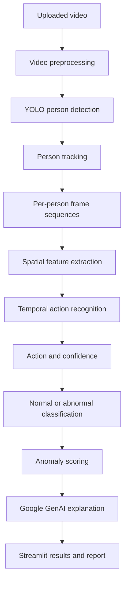

# AVAS

AVAS is an AI-assisted video analysis system for human action recognition and anomaly detection. It analyzes motion across sequences of frames, identifies potentially abnormal behavior, and presents model evidence in a form that a human operator can review.

The project combines computer vision, temporal deep learning, and generative AI. Deep learning produces the predictions, while generative AI is limited to explaining those predictions and preparing readable reports.

> **Project status:** AVAS is under active development. A runnable application, trained checkpoints, and reproducible setup instructions are not yet available in this repository.

## Key Capabilities

- Accept uploaded video files for offline analysis.
- Detect people in individual frames with YOLO.
- Preserve person identities across frames with multi-object tracking.
- Build temporal sequences for each tracked person.
- Recognize actions with a spatiotemporal deep learning model.
- Report confidence scores, timestamps, and anomaly scores.
- Classify observed behavior as normal, suspicious, or abnormal.
- Generate operator-facing explanations without changing model predictions.
- Present video, detections, tracks, events, and reports through Streamlit.

## Why Temporal Analysis Matters

Object detection answers where a person is in a frame. It does not determine what that person is doing over time.

AVAS separates these responsibilities:

```text
Person detection
       +
Person tracking
       +
Temporal modeling
       =
Action recognition
```

For example, a single frame may not reliably distinguish standing from falling. A sequence of frames captures the transition in posture and motion needed to classify the event.

## Processing Pipeline



### 1. Video Preprocessing

Uploaded videos are decoded into frames or short clips. Preprocessing may include:

- Frame-rate reduction for large videos
- Frame resizing
- Pixel normalization
- Clip segmentation
- Fixed-length sequence sampling

Sequence length and sampling strategy depend on the selected model architecture.

### 2. Person Detection

YOLO locates people in each frame and returns bounding boxes with detection confidence. Detection is a supporting component and is not used as the action classifier.

### 3. Person Tracking

ByteTrack or DeepSORT associates detections across frames. The resulting track ID allows AVAS to construct a separate motion history for each visible person.

### 4. Action Recognition

The baseline model uses a CNN and LSTM:

```text
Frame sequence
      |
      v
CNN feature extractor
      |
      v
LSTM temporal model
      |
      v
Action classifier
```

The CNN extracts visual features from each frame. The LSTM models how those features change over time and produces an action prediction for the sequence.

Alternative video architectures, such as 3D CNNs and video transformers, can be evaluated against the baseline when comparable training and test conditions are available.

### 5. Anomaly Assessment

Recognized actions are mapped to an operational category. A configuration might classify walking, standing, and sitting as normal while classifying falling or fighting as abnormal.

An anomaly score can provide additional severity information:

```text
Low score       -> Normal
Moderate score  -> Suspicious
High score      -> High risk
```

Thresholds must be calibrated from validation data. They should not be treated as universal constants.

### 6. Report Generation

Google GenAI receives structured model output such as:

- Predicted action
- Model confidence
- Event duration
- Anomaly score
- Start and end timestamps

It converts these fields into an incident summary, risk explanation, and suggested review action. It must not replace, revise, or override the underlying deep learning prediction.

## Example Analysis Output

The final schema may evolve, but an event is expected to contain information similar to:

```json
{
  "video": "security_camera_01.mp4",
  "person_id": 2,
  "action": "fighting",
  "confidence": 0.962,
  "status": "abnormal",
  "anomaly_score": 0.92,
  "start_time": "00:01:42",
  "end_time": "00:01:49"
}
```

The interface can use this structured result to highlight the relevant track, replay the event window, and display a plain-language explanation.

## Behavior Classes

The available labels depend on the training dataset. Candidate classes include:

- Walking
- Running
- Standing
- Sitting
- Falling
- Fighting
- Jumping
- Waving

AVAS does not assume that every unusual behavior can be represented by a fixed label set. Predictions are limited by the data and model used during training.

## Candidate Datasets

- **UCF101:** General human action recognition and baseline experiments
- **HMDB51:** Human motion classes and cross-dataset evaluation
- **UCF-Crime:** Long-form surveillance videos containing normal and anomalous events

Datasets are not distributed with this repository. Their licenses, access conditions, class definitions, and intended uses must be reviewed before training or redistribution.

## Data Preparation Requirements

Dataset partitions must be created at the source-video level. Frames or clips from the same video must never be split across training, validation, and test sets because that would introduce data leakage.

Other data risks that require explicit handling include:

- Class imbalance
- Duplicate or near-duplicate videos
- Incorrect or ambiguous labels
- Variation in camera angle, lighting, resolution, and background
- Differences between benchmark footage and real deployment footage

Possible imbalance controls include weighted loss, oversampling, and data augmentation. Their effect must be measured on a separate validation set.

## Evaluation

Model quality should be measured with more than accuracy:

- Precision
- Recall
- F1-score
- Per-class metrics
- Confusion matrix

Recall is especially important when the cost of missing an abnormal event is high. Precision remains necessary to prevent excessive false alerts.

Operational performance should also be reported:

- Frames processed per second
- End-to-end processing time
- Inference latency
- CPU and GPU utilization
- GPU memory consumption
- Model size

All published results should identify the dataset split, hardware, model checkpoint, input resolution, sequence length, and decision thresholds used for evaluation.

## Technology Stack

- **Language:** Python
- **Deep learning:** PyTorch and TorchVision
- **Computer vision:** OpenCV and YOLO
- **Tracking:** ByteTrack or DeepSORT
- **Data processing:** NumPy and Pandas
- **Visualization:** Matplotlib
- **Generative AI:** Google GenAI
- **Application interface:** Streamlit

Exact dependency versions will be documented with the executable implementation.

## Intended Interface

The Streamlit application is designed to provide:

- Video upload and playback
- Bounding-box overlays
- Tracking IDs
- Detected action labels
- Confidence and anomaly scores
- Event timestamps
- Normal or abnormal status
- Generated incident analysis

Supported upload formats are expected to include MP4, AVI, MOV, and MKV, subject to the codecs available in the runtime environment.

## Responsible Use

AVAS is a decision-support tool, not an autonomous decision maker. Its output can contain false positives, false negatives, and incorrect action labels.

Before using a result:

1. Review the relevant video segment.
2. Confirm that the tracked person and timestamp are correct.
3. Consider environmental and contextual information unavailable to the model.
4. Require human verification before taking consequential action.

Deployments must also follow applicable privacy, surveillance, data retention, and access-control requirements.

## Known Limitations

- Performance may decrease under poor lighting, occlusion, low resolution, or unusual camera angles.
- Models trained on public datasets may not generalize to a new camera environment.
- Tracking errors can mix identities or fragment a person's motion history.
- Fixed action classes cannot describe every real-world event.
- Anomaly scores are model-specific and require calibration.
- Generated explanations can improve readability but cannot validate model correctness.

## License

This project is licensed under the MIT License. See [LICENSE](LICENSE) for the full text.
